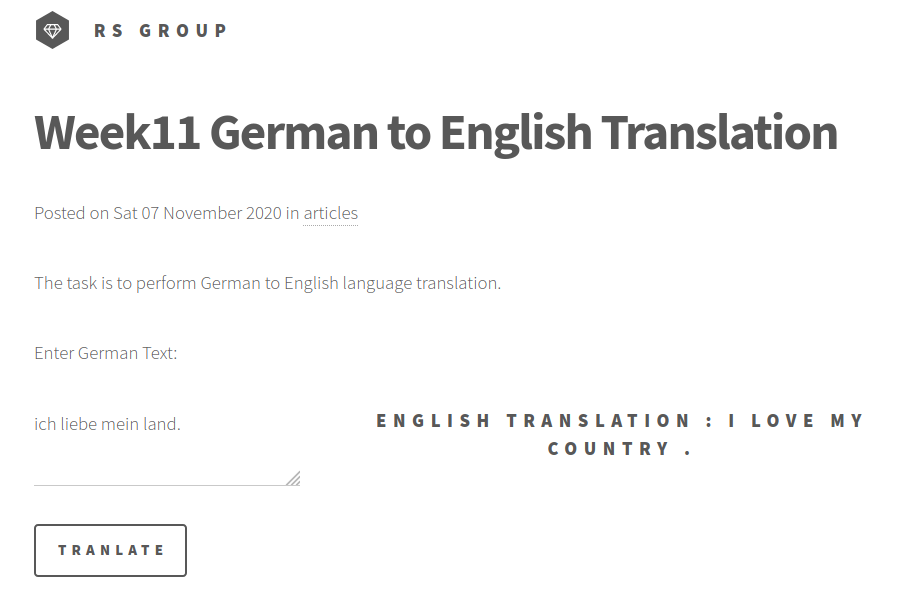
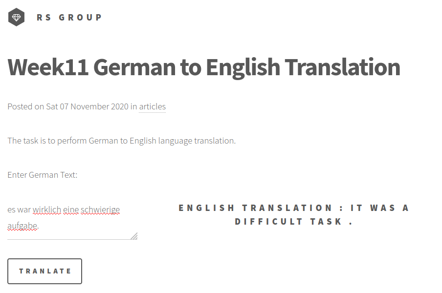
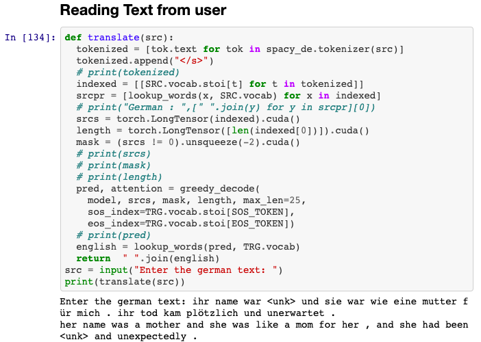

# Session 11 - GRU, Attention Mechanism & Transformers: Attention is all you need!

## 1. Executive Summary
**Group Members:** *Ramjee Ganti, Srinivasan G, Roshan, Dr. Rajesh and Sujit Ojha*

### **Objectives**:

- Look at this [file](https://bastings.github.io/annotated_encoder_decoder/)
- Re-implement this and move to lambda. Provide the option to provide German text and get English text back. 

### **Results**:

- Team hosted static website : http://rsgroup.s3-website.ap-south-1.amazonaws.com/
- Website results
    - 
- Colab results
    - 

## 2. Steps (Developer Section)

- Training & Saving Model [Notebook](EVA4P2_S11_annotated_encoder_decoder_deployment_v2.ipynb)
    - Based on Ref #1: [The Annotated Encoder Decoder](https://bastings.github.io/annotated_encoder_decoder/)
- Deployment [Notebook](EVA4P2_S11_annotated_encoder_decoder.ipynb)

## 3. References

1. [The Annotated Encoder Decoder](https://bastings.github.io/annotated_encoder_decoder/)
2. [Save and Load Machine Learning Models in Python with scikit-learn](https://machinelearningmastery.com/save-load-machine-learning-models-python-scikit-learn/)
3. [How to Speed up AWS Lambda deployment on Serverless Framework by leveraging Lambda Layers.](https://gaurav4664.medium.com/how-to-speed-up-aws-lambda-deployment-on-serverless-framework-by-leveraging-lambda-layers-623f7c742af4)
4. [EVA4 Phase2 Session 11 - GRU, Attention Mechanism & Transformers: Attention is all you need!](https://theschoolof.ai/)

