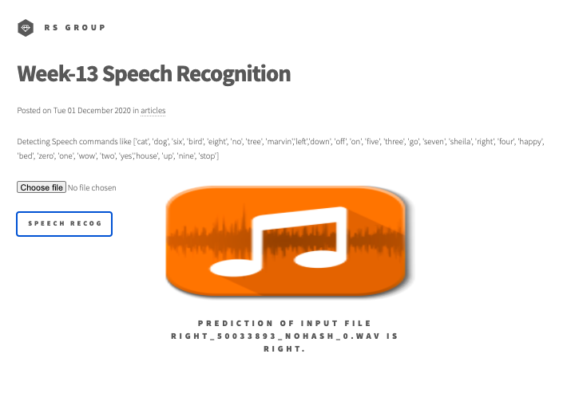
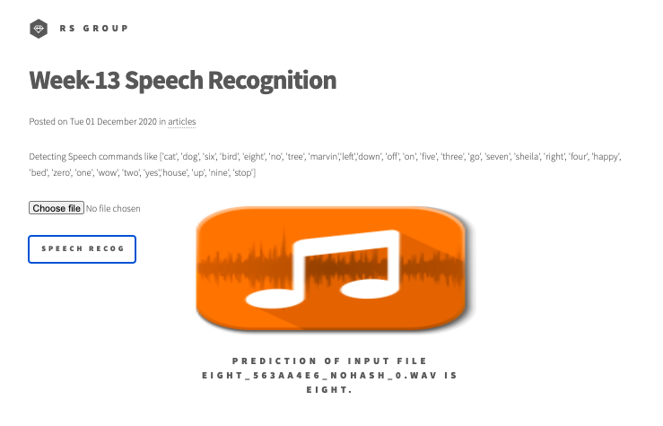
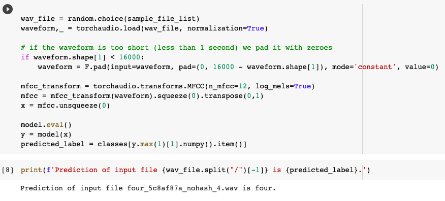

# Session 13 - AI for Sound

## 1. Executive Summary
**Group Members:** *Ramjee Ganti, Srinivasan G, Roshan, Dr. Rajesh and Sujit Ojha*

### **Objectives**:

- Train both the models. Try to move the one you like to Lambda, and as usual, your submit your Lambda link. 

### **Results**:

- Team hosted static website : http://rsgroup.s3-website.ap-south-1.amazonaws.com/
- Website results
    - 
- Colab results
    - 

### **Key Highlights**:
- Training Model1: "Basic Audio Processing and a Simple Model" [EVA4P2_Session13_Speech_recognition_model1_training_v1.ipynb](EVA4P2_Session13_Speech_recognition_model1_training_v1.ipynb)
    - Best accuracy Training: 94.51%, Validation: 91.04%, Test: 91.075%
- Training Model2: "Deep Speech 2" [Building_an_end_to_end_Speech_Recognition_model_in_PyTorch.ipynb](Building_an_end_to_end_Speech_Recognition_model_in_PyTorch.ipynb)

## 2. AI for Sound (Deep Speach 2)

Our model will be similar to the Deep Speech 2 architecture. The model will have two main neural network modules - N layers of Residual Convolutional Neural Networks (ResCNN) to learn the relevant audio features, and a set of Bidirectional Recurrent Neural Networks (BiRNN) to leverage the learned ResCNN audio features. The model is topped off with a fully connected layer used to classify characters per time step.

Convolutional Neural Networks (CNN) are great at extracting abstract features, and we'll apply the same feature extraction power to audio spectrograms. Instead of just vanilla CNN layers, we choose to use Residual CNN layers. Residual connections (AKA skip connections) were first introduced in the paper [Deep Residual Learning for Image Recognition](https://arxiv.org/abs/1512.03385), where the author found that you can build really deep networks with good accuracy gains if you add these connections to your CNN's. Adding these Residual connections also helps the model learn faster and generalize better. The paper [Visualizing the Loss Landscape of Neural Nets](https://arxiv.org/abs/1712.09913) shows that networks with residual connections have a “flatter” loss surface, making it easier for models to navigate the loss landscape and find a lower and more generalizable minima.

Recurrent Neural Networks (RNN) are naturally great at sequence modeling problems. RNN's processes the audio features step by step, making a prediction for each frame while using context from previous frames. We use BiRNN's because we want the context of not only the frame before each step, but the frames after it as well. This can help the model make better predictions, as each frame in the audio will have more information before making a prediction. We use Gated Recurrent Unit (GRU's) variant of RNN's as it needs less computational resources than LSTM's, and works just as well in some cases.

 

The model outputs a probability matrix for characters which we'll use to feed into our decoder to extract what the model believes are the highest probability characters that were spoken.

[CODE](https://colab.research.google.com/drive/1Z-4MiFimY9JPWk93V0MwblXu2iS8Lzp0?usp=sharing)

## 3. Steps (Developer Section)

**MODEL1**
- Training [Notebook](EVA4P2_Session13_Speech_recognition_model1_training_v1.ipynb)
- Deployment [Notebook](EVA4P2_Session13_Speech_recognition_model1_inference_v1a.ipynb), [handler.py](NeuralEmbedding-Deployment/handler.py) and [serverless.yml](NeuralEmbedding-Deployment/serverless.yml)
    - Using serverless, python-plugin-requirements

**MODEL2**
- Training [Notebook](Building_an_end_to_end_Speech_Recognition_model_in_PyTorch.ipynb)

## 4. References

1. [Basic Audio Processing and a Simple Model](https://colab.research.google.com/drive/1z6Ia_zT9HbAd6zxpafDVzd1Q0klMGaA4?usp=sharing)
2. [Building an end-to-end Speech Recognition model in PyTorch](https://www.assemblyai.com/blog/end-to-end-speech-recognition-pytorch)
3. [Deep Speech 2, Colab](https://colab.research.google.com/drive/1Z-4MiFimY9JPWk93V0MwblXu2iS8Lzp0?usp=sharing)
4. [EVA4 Phase2 Session 13 - AI for Sound](https://theschoolof.ai/)

