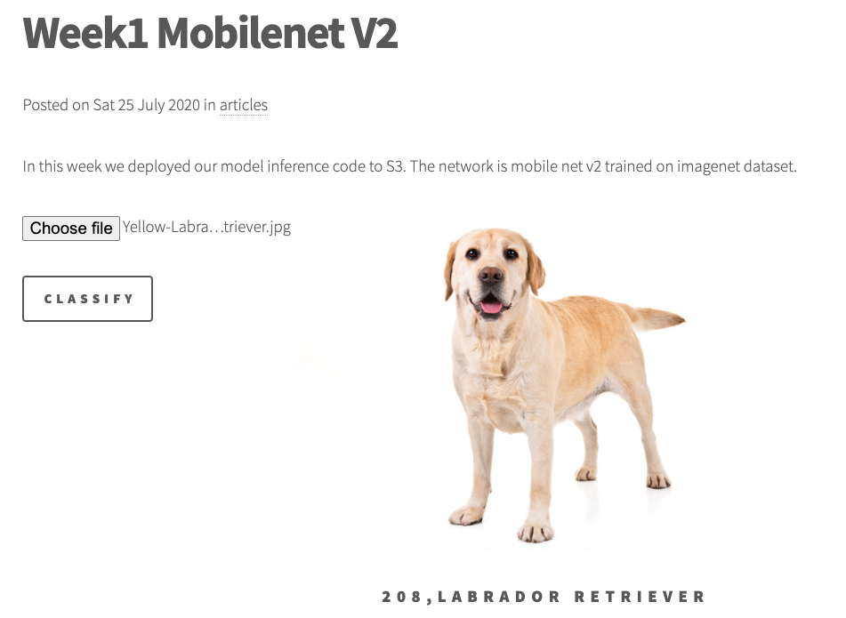
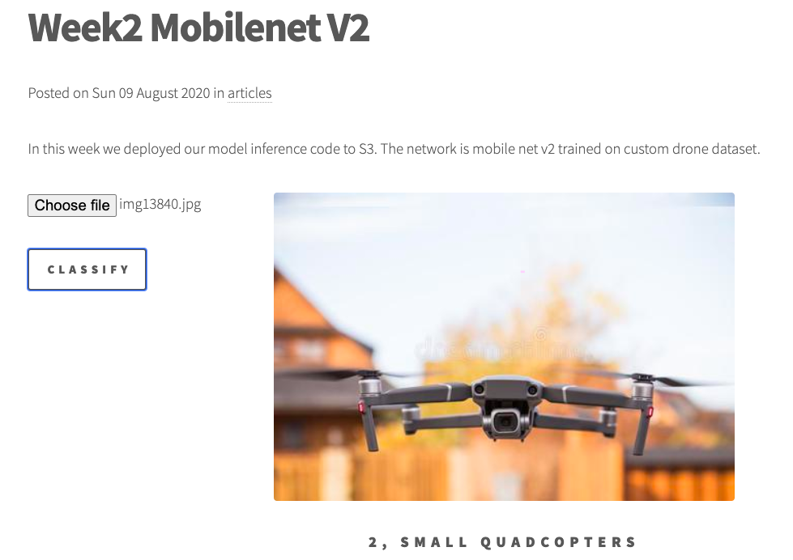
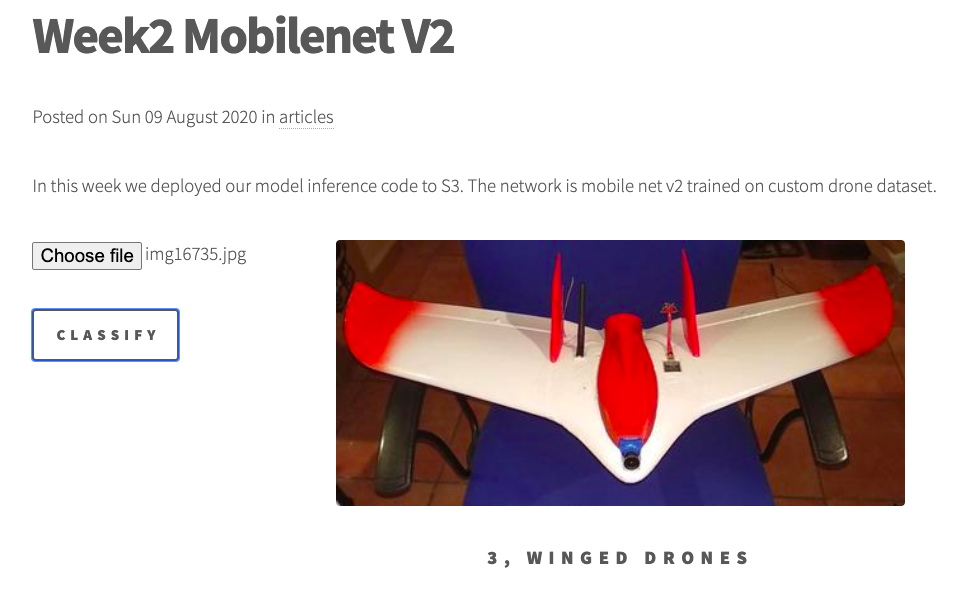
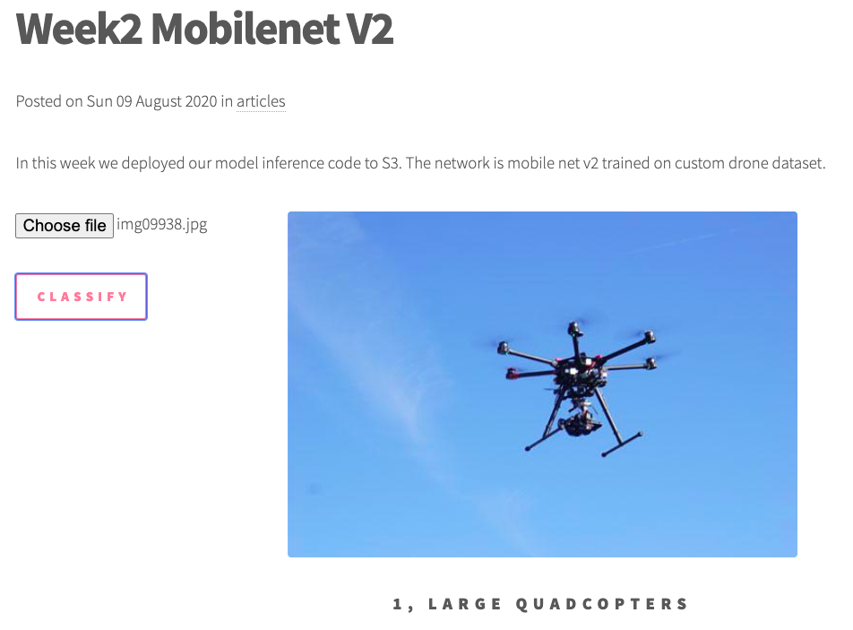
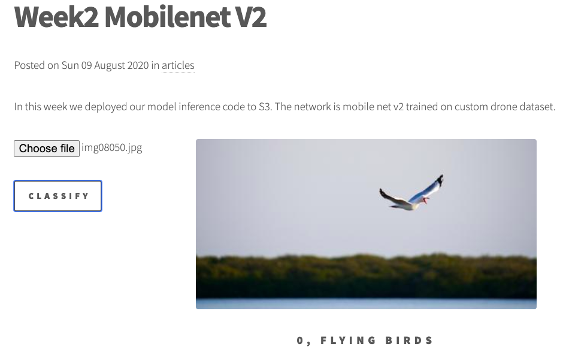
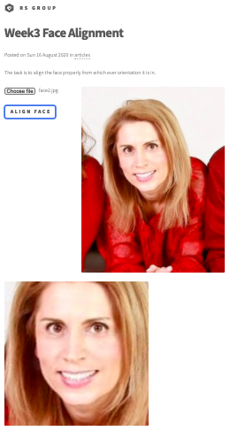
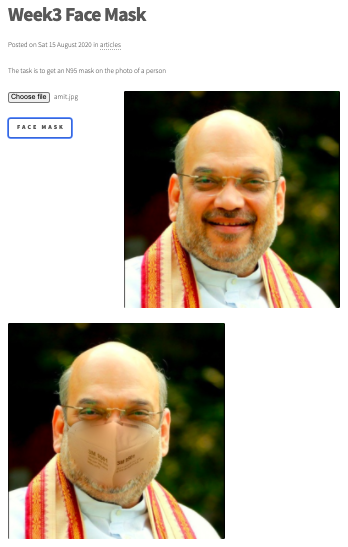
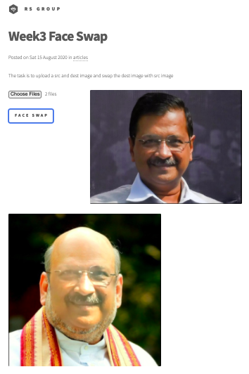
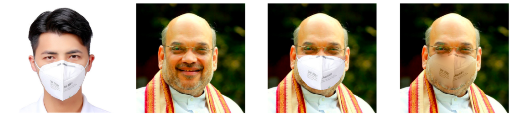

# Session 3 - Face Recognition & AWS static Website

## 1. Executive Summary
**Group Members:** *Ramjee Ganti, Srinivasan G, Roshan, Dr. Rajesh and Sujit Ojha*

### **Objectives**:

- Upload html and js files to your S3 bucket and create a policy using which the html file can be accessed by anyone. The HTML file should contain:
    1. ResNet Example (as shared in the code above)
    2. MobileNet Example (trained on your dataset)
    3. Face Alignment Feature (as shared above)
        - Bonus 1000 points additional from 3000 for this assignment if you implement Face Swap.
- Create a Face Alignment App on Lambda (code is shared above), where if someone uploads a face (you check that by using dlib face detector), you return aligned face. Image with more than 1 face is not processed for alignment.
- Share the link to your S3 html file that can be accessed by anyone. Also share the link to your GitHub repo for the code (please remember to always remove the keys, secrect_keys, etc from your code before uploading to GitHub. How?)

### **Results**:
- Team hosted static website : http://rsgroup.s3-website.ap-south-1.amazonaws.com/
    - Resnet imagenet from [Session 1](https://github.com/EVA4-RS-Group/Phase2/tree/master/S1_aws_lambda_mobilenet_v2)
    - MobileNet Example from [Session 2](https://github.com/EVA4-RS-Group/Phase2/tree/master/S2_mobilenet_v2_custom_dataset)
    - FaceAlignment & FaceSwap application - putting mask, Details are covered in Developer Section.
- Website results
    - 
    - 
    - 
    - 

### **Key Highlights**
- Website hosting: We use [pelican](https://blog.getpelican.com/) a static site generator written in python. Each of the assignments is then article/blog post.
- Face Alignment (#Roshan, please highlight)
- Face Swap, Mask: We developed a face swap application which will put mask on image with single face. It utilizes landmarks below eye portion to develop a convex hull. Then it swaps this portion with image having N95 mask.
- Deployment: Got two github actions one for [deploying the website](https://github.com/EVA4-RS-Group/Phase2/actions?query=workflow%3A%22Frontend+Deploy%22) and the other for [deploying to the lambda](https://github.com/gantir/eva4-2/actions?query=workflow%3A%22EVA4+Phase2+Week3%22). The actions get triggered when code is committed to master branch

## 2. Steps (Developer Section)
- Website Hosting
  - Used Pelican static site generator for python.
  - URL of website: http://rsgroup.s3-website.ap-south-1.amazonaws.com/
  - Created a theme based on [html5up](https://html5up.net/uploads/demos/phantom/)
  - Created 5 articles: Week1, Week2, Week3 FaceSwap, Week3 FaceMask, Week3 FaceAlign
  - Wrote javascript to upload image and use the same to call the Lambda inference API
- Face Alignment (#Roshan, Detailed Steps)
- Face Swap, Mask [EVA4_Phase2_S3_FaceMask.ipynb](EVA4_Phase2_S3_FaceMask.ipynb)
    - Using DLIB face detection and 68 points landmark detection
    - Face mask intermediate results
    - 

## 3. References

1. [Hosting AWS static website](https://docs.aws.amazon.com/AmazonS3/latest/dev/HostingWebsiteOnS3Setup.html)
2. [EVA4 Phase2 Session3, Face Recognition Part 1](https://theschoolof.ai/)
