# Session 4 - Face Recognition Part II, 10 Celebrities/Politician

## 1. Executive Summary
**Group Members:** *Ramjee Ganti, Srinivasan G, Roshan, Dr. Rajesh and Sujit Ojha*

### **Objectives**:

- Refer to this beautiful [blog](https://towardsdatascience.com/finetune-a-facial-recognition-classifier-to-recognize-your-face-using-pytorch-d00a639d9a79). 
- Collect 10 facial images of 10 people you know (stars, politicians, etc). The more the images you collect, the better your experience would be. Add it to this [LFW](http://vis-www.cs.umass.edu/lfw/lfw-funneled.tgz) dataset. 
- Train as in the blog and upload the FR model to Lambda
- Share the link to "that" single page. 
- Share the link to GitHub repo. 

### **Results**:
- Curated dataset consisting of 10 known people
    -  **Aishwarya Rai, Elon Musk, Mahendra Singh Dhoni, Malala Yousafzai, Narendra Modi, Priyanka Chopra, Rahul Gandhi, Sachin Tendulkar, Shahrukh Khan, Shreya Ghoshal.**
    - Added LFW dataset with classess more than 20 images. Additional classes around 62. 
    - Processed all images to align the face and create train/val dataset. [EVA4_S4_preprocessing_face_alignment_v1.ipynb](https://github.com/EVA4-RS-Group/Phase2/blob/master/S4_FaceRecognition/EVA4_S4_preprocessing_face_alignment_v1.ipynb)
- Trained inception_resnet model using transfer learning for face recognition of classess (10 - custom dataset, 62 - LFW). [EVA4_P2_S4_Face_Recognition_v2.ipynb](https://github.com/EVA4-RS-Group/Phase2/blob/master/S4_FaceRecognition/EVA4_P2_S4_Face_Recognition_v2.ipynb)
    - Model performance, Training accuracy = **99.91%** and Validation accuracy = **99.50%**
- Team hosted static website : http://rsgroup.s3-website.ap-south-1.amazonaws.com/
- Website results
    - 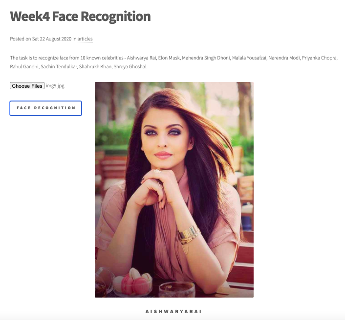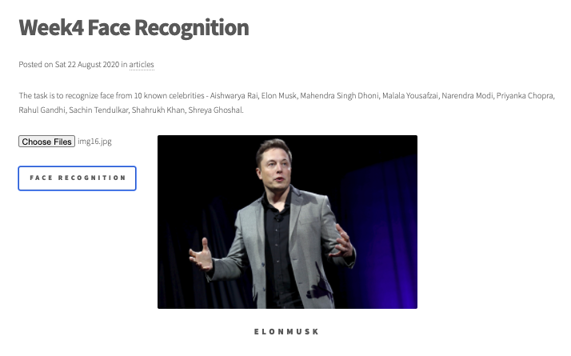
    - 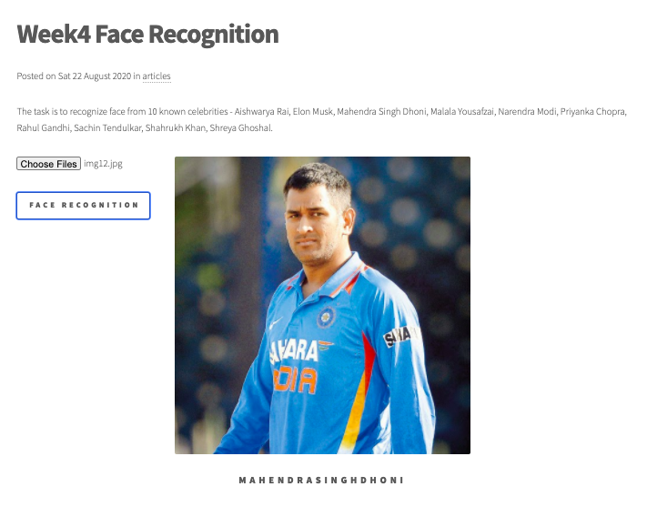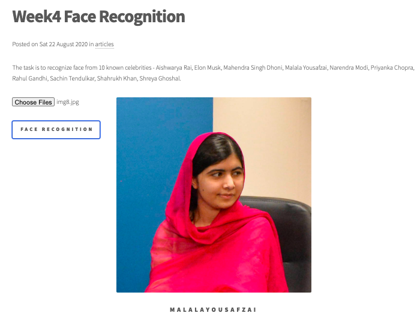
    - 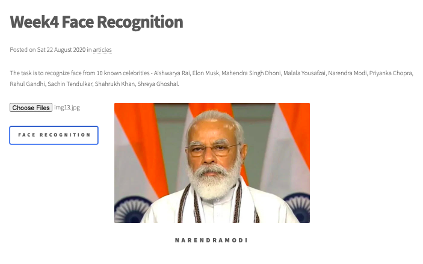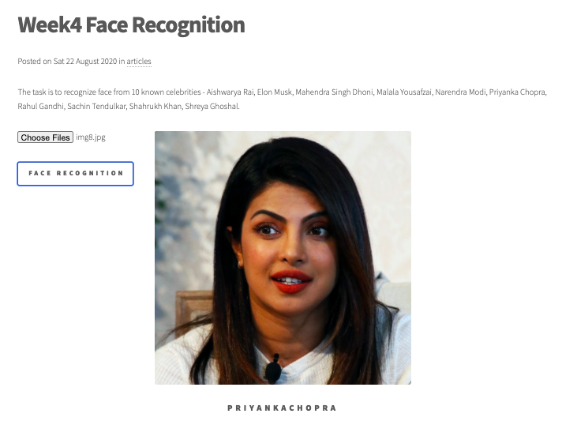
    - 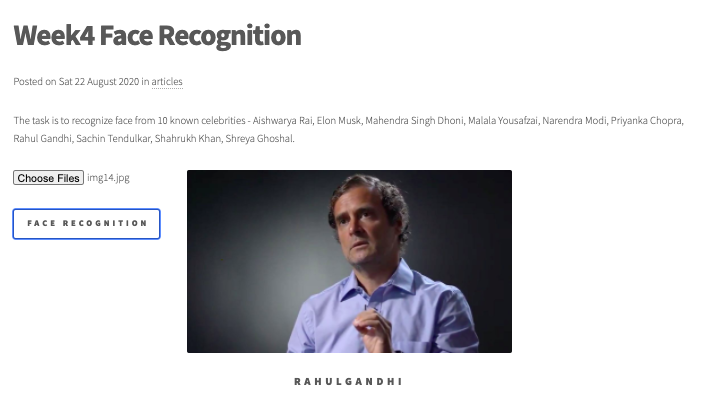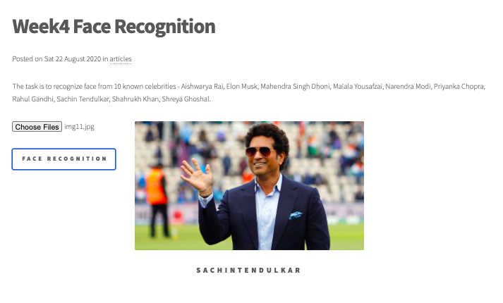
    - 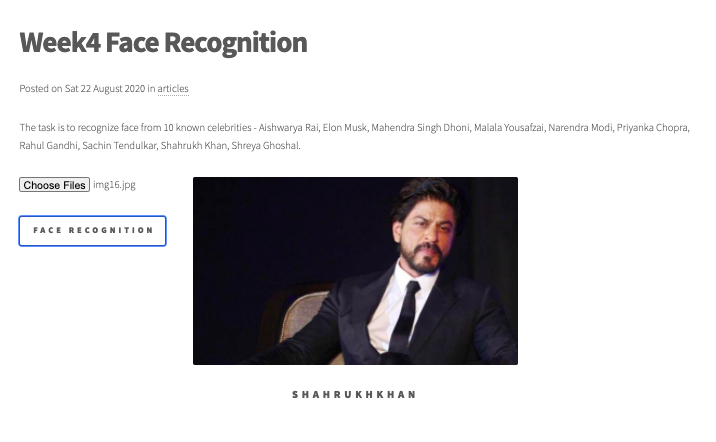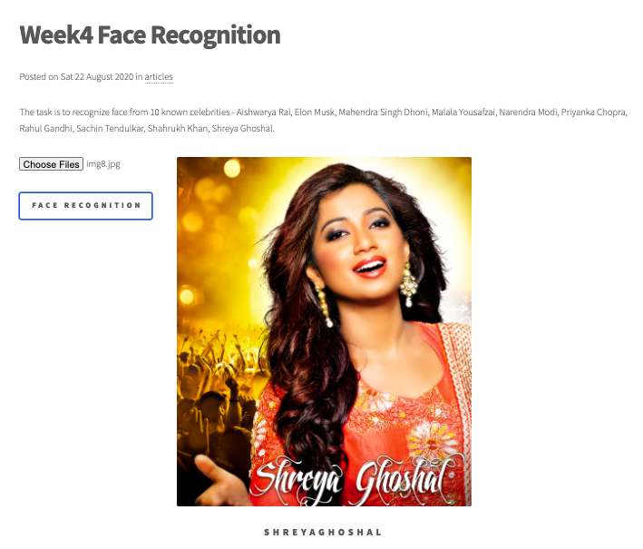

### **Key Highlights**
- Training Dataset Curation
    - Total number of classess = 72, Total images = 3366
    - Face aligned and cropped to 160x160 pixel 
- Face Recognition Model Training
    - Transfer learning from inception_resnet_v1 with "vggface2" pretrained weights. Only last 5 layers trained.
    - OneCycle Policy : Trained the network in 10 epochs
    - Modularized code 
- Deployment
    - AWS Lambda deployment: To manage the zip requirement < 150mb,face recognition calls the face alignment api to get the images uploaded aligned and resized before sending to model.

## 2. Steps (Developer Section)
- Dataset Curation & Preprocessing - Face Alignment and Cropping [EVA4_P2_S4_Face_Recognition_v2.ipynb](https://github.com/EVA4-RS-Group/Phase2/blob/master/S4_FaceRecognition/EVA4_P2_S4_Face_Recognition_v2.ipynb)
    - Curated custom dataset manually by searching through google with closeup views. It consist of 10 different celebrities with 20 images each. [Raw dataset](https://github.com/EVA4-RS-Group/Phase2/releases/download/S4/Data_v1.zip)
    - Combined the custom dataset with [LFW](http://vis-www.cs.umass.edu/lfw/lfw-funneled.tgz) dataset. Filtered LFW dataset with classess having 20 or more images.
    - Face Alignment based on [Session 3](https://github.com/EVA4-RS-Group/Phase2/tree/master/S3_FaceAlignment) and resized to 160x160 pixel sizes.
        - 
        - 
    - Split the dataset into 70:30 ratio for training and validation.
- Face Recognition model training [EVA4_P2_S4_Face_Recognition_v2.ipynb](https://github.com/EVA4-RS-Group/Phase2/blob/master/S4_FaceRecognition/EVA4_P2_S4_Face_Recognition_v2.ipynb)
    - Data Loader with data augmentation (Image horizontal flip, Color Jitter and Image normalization to imagenet stats). Sample images are below
        - 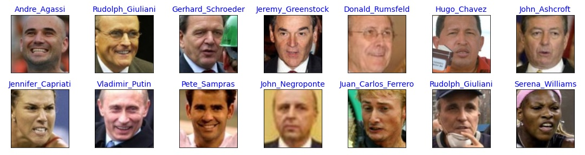
    - Loading the [Inception_resnet_v1](models/inception_resnet_v1.py)  model with "VGG_FACE2" pre-trained weights.
    - Removing last 5 layers and freezing all other layers. Adding then adaptive average pool layers with two full connected layers
    - Running LR Finder to find the max learning rate for OneCycle policy for optimizer.
    - Training the model for 10 epoch, Training accuracy = **99.91%** and Validation accuracy = **99.50%**
    - Loss & Accuracy graph
        - 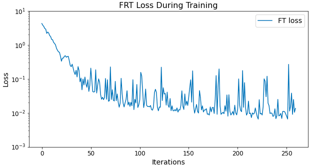
        - 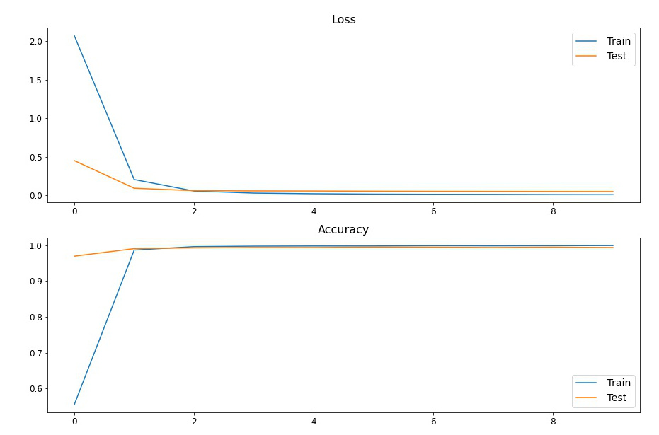
    - Visualize Model Predictions (Dashboard) 
        - 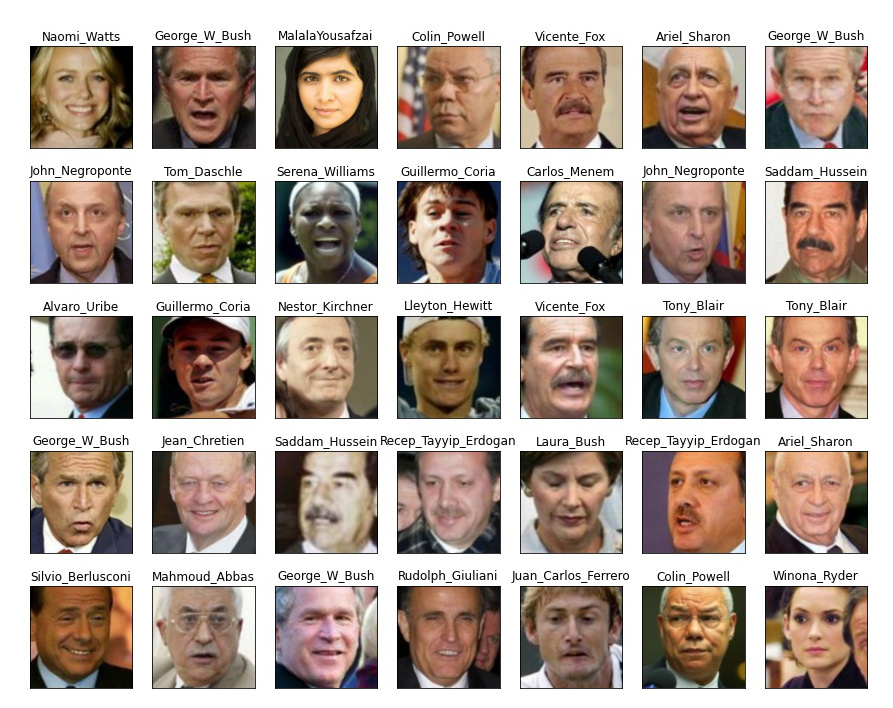
    - Predictions on Validation custom dataset
        - Aishwarya Rai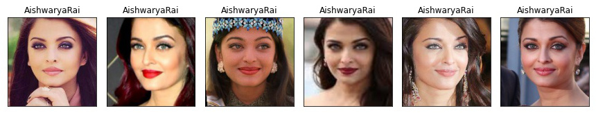 
        - Elon Musk 
        - Mahendra Singh Dhoni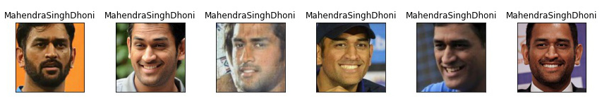 
        - Malala Yousafzai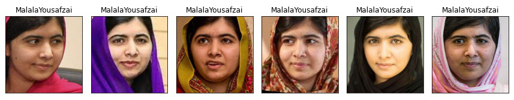 
        - Narendra Modi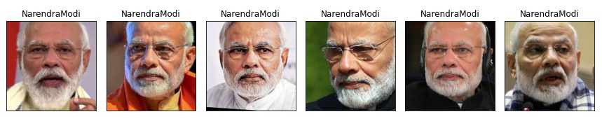 
        - Priyanka Chopra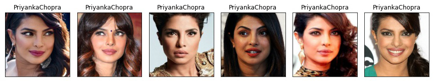 
        - Rahul Gandhi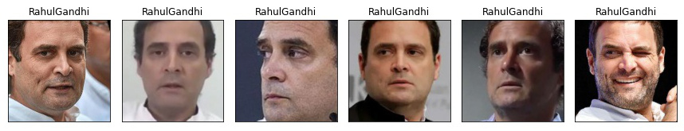 
        - Sachin Tendulkar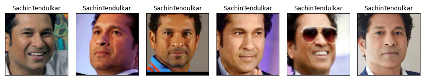 
        - Shahrukh Khan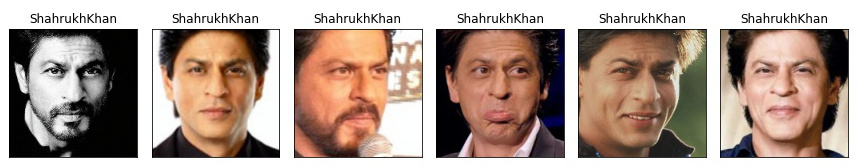 
        - Shreya Ghoshal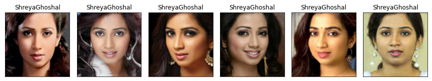
    - Saved the traced model (CPU) for deployment
- Deployment

## 3. References

1. [Finetune a Facial Recognition Classifier to Recognize your Face using PyTorch](https://towardsdatascience.com/finetune-a-facial-recognition-classifier-to-recognize-your-face-using-pytorch-d00a639d9a79)
2. [Labeled Faces in the Wild](http://vis-www.cs.umass.edu/lfw/)
3. [Hosting AWS static website](https://docs.aws.amazon.com/AmazonS3/latest/dev/HostingWebsiteOnS3Setup.html)
4. [EVA4 Phase2 Session3, Face Recognition Part 1](https://theschoolof.ai/)
