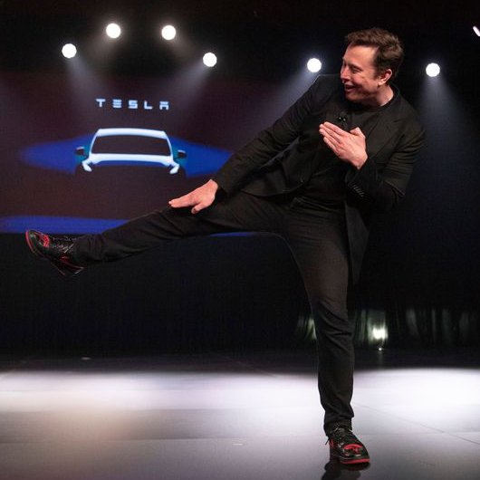
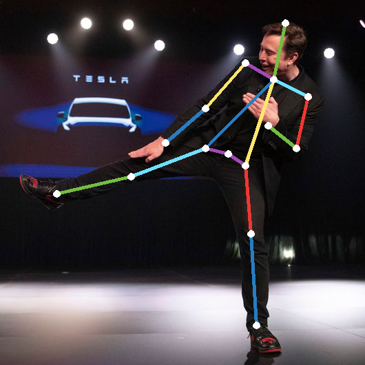

# Session 5 - Monocular Human Pose Estimation

## 1. Executive Summary
**Group Members:** *Ramjee Ganti, Srinivasan G, Roshan, Dr. Rajesh and Sujit Ojha*

### **Objectives**:

- You are implementing "[Simple Baseline for HPE and tracking](https://github.com/Microsoft/human-pose-estimation.pytorch)". Read the [paper](https://arxiv.org/pdf/1804.06208.pdf) and write a detailed readme file describing the model architecture as well as the JointsMSELoss class.
- Download the [smallest model](https://onedrive.live.com/?authkey=%21AFkTgCsr3CT9%2D%5FA&id=56B9F9C97F261712%2110709&cid=56B9F9C97F261712) and upload to Lambda for HPE detection
- Make sure to draw the points on the image, as well as connect the joints in the right fashion.

### **Results**:

- Team hosted static website : http://rsgroup.s3-website.ap-south-1.amazonaws.com/
- Website results
    - 

### **Simple Baseline for HPC and Tracking - Model Architecture and JointsMSELoss**

- The model proposed simply adds 3 deconvolutional layers over the last convolution stage in the ResNet backbone network, called C5.   
- This structure is simplest to generate heatmaps from deep and low resolution features.
- This model also adopted in the state-of-the-art Mask R-CNN
- It is a bottom-up approach, since the model is going to predict the probability of joints as heatmaps.

- 3 deconvolutional layers with batch normalization (BN) and ReLU activation are used. 
- Each layer has 256 filters with kernel size (4 × 4) with a stride of 2.
- A (1 × 1) convolutional layer is added at last to generate predicted heatmaps for all 16 key points.

Mean Squared Error (MSE) is used as the loss between the predicted heatmaps and targeted heatmaps. 
The targeted heatmap for 16 key points are generated by applying a 2D gaussian centered on the key point ground truth location.

This method combines the upsampling and convolutional parameters into deconvolutional layers in a much simpler way,
without using skip layer connections.

3 upsampling steps and 3 levels of non-linearity (from the deepest feature) are used to obtain highresolution feature maps and heatmaps.

Obtaining high resolution feature maps is crucial whatever the way it is obtained.
In the following code we can appriciate its network and understand its implementation

Code: [pose_resnet.py](src/pose_resnet.py)

### JointsMSELoss

The loss is a simple 0.5 \* sqrt(joint_coord - target_coord)^2 , but also the target coordinates of the joint in the ground truth can have weights assigned to them, so that specific joints can be trained more/ penalised more.

When using the [MPII Dataset](http://human-pose.mpi-inf.mpg.de/), there are going to be 16 joints predicted, i.e. 16 layers in the output of the model.

Code: [loss.py](src/loss.py)

Here, the max values in the heatmaps are obtained first, this will most probably give the right prediction, but we can do further post-processing to get the exact centre of the prediction, which is done by applying 2D gaussian centered on the heatmap.

### **Key Highlights**
- Model Conversion & Inferencing
    - Defined an inference class to manage the joints, pairs, defining the model, image transformation and model conversion. **Bascially an modularized code.**
    - ONNX Conversion, Model converted to ONNX format with int8 quantization which resulted in **~2x reduction in model size (136 mb to 66 mb) and inference speed improvement by ~1.6x(519.18 ms to 316.61 ms)**
- Plotting using openCV
    - Heatmaps of each joints are converted into point using openCV min_max point with probability. Used openCV elllipse and line function to draw the joints and join the joints with given color pattern
- Deployment

## 2. Steps (Developer Section)
- Model Conversion & Inferencing, HPE [EVA4_P2_S5_HumanPoseEstimation_ONNX_Quant_v1.ipynb](EVA4_P2_S5_HumanPoseEstimation_ONNX_Quant_v1.ipynb)
    - Defining inferencing class ()
    - Plotting OpenCV 
    - Model Conversion
- Deployment

## 3. References

1. [Simple Baseline for HPE and tracking](https://github.com/Microsoft/human-pose-estimation.pytorch)
2. [Human Pose Estimation Blog by Satyajitghana](https://medium.com/@satyajitghana7/human-pose-estimation-and-quantization-of-pytorch-to-onnx-models-a-detailed-guide-b9c91ddc0d9f)
3. [EVA4 Phase2 Session5, Human Pose Estimation](https://theschoolof.ai/)
