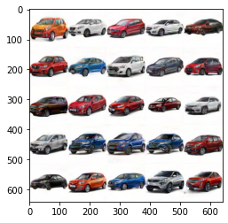
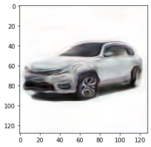
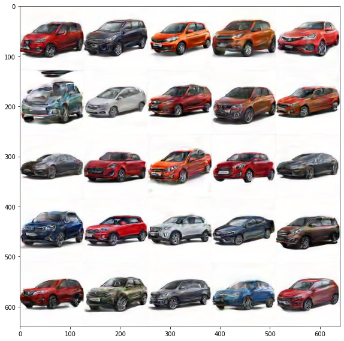
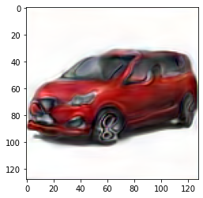

# Session 6 - Generative Adversarial Network

## 1. Executive Summary
**Group Members:** *Ramjee Ganti, Srinivasan G, Roshan, Dr. Rajesh and Sujit Ojha*

### **Objectives**:

- Train any GAN to create 100x100 images of Indian Cars.
- KISS! (Keep it Simple)
- Move to Lambda and on your site. 

### **Results**:

- Team hosted static website : http://rsgroup.s3-website.ap-south-1.amazonaws.com/
- Website results
    - 
- Colab results
    - 

### **Key Highlights**
- Dataset curation & Preprocessing - [raw images](https://drive.google.com/drive/folders/1nskvo2QBLbtvIrXdoZeE5hRFp1WPNs3N?usp=sharing),  [processed images](https://github.com/EVA4-RS-Group/Phase2/releases/download/S6/processed_images_step4a.zip) and [EVA4_P2_S6_GenerativeAdversarialNetwork_Data_Preprocessing_v1.ipynb](Training/EVA4_P2_S6_GenerativeAdversarialNetwork_Data_Preprocessing_v1.ipynb)
- Training based on R1GAN Network[EVA4_P2_S6_R1GAN_128x128_2000_epoches_v1.ipynb](Training/EVA4_P2_S6_R1GAN_128x128_2000_epoches_v1.ipynb)
    - Updated the network to process 128x128 pixel instead of 64x64 pixels.
- Model Conversion & Inferencing
- Deployment
    - Quantization results

## 2. Steps (Developer Section)
- Dataset Curation & Preprocessing - [raw images](https://drive.google.com/drive/folders/1nskvo2QBLbtvIrXdoZeE5hRFp1WPNs3N?usp=sharing) and [processed images](https://github.com/EVA4-RS-Group/Phase2/releases/download/S6/processed_images_step4a.zip)
    - Downloaded 500+ images from https://www.cleanpng.com/, google and other care re-sale websites eg. cardekho.
    - Downloading criteria to keep the training simple,
        - White background or blank background
        - One direction of orientation or can be flipped to get same orientation
    - Processed images manually to flip the images and removed background for some of the images.
    - Finally processed all the image to generate 128x128 pixel images by resizing and padding white background. [EVA4_P2_S6_GenerativeAdversarialNetwork_Data_Preprocessing_v1.ipynb](Training/EVA4_P2_S6_GenerativeAdversarialNetwork_Data_Preprocessing_v1.ipynb)
- Training based on R1GAN, Reference #1 [EVA4_P2_S6_R1GAN_128x128_2000_epoches_v1.ipynb](Training/EVA4_P2_S6_R1GAN_128x128_2000_epoches_v1.ipynb)
    - Updated the Generator and Discriminator for 128x128 pixel with additional layer of convolution
    - Trained for 2000+ epoches to improve the images generated. Sample images below,
    - 
- Converted the model to onnx  [EVA4_P2_S6_R1GAN_128x128_onnx_v2.ipynb](Training/EVA4_P2_S6_R1GAN_128x128_onnx_v2.ipynb)
    - 

## 3. References

1. [R1GAN, GAN with R1 Regularizer](https://github.com/Yangyangii/GAN-Tutorial/blob/master/CelebA/R1GAN.ipynb)
2. [DCGAN, Deep Convolutional GANs](https://github.com/Yangyangii/GAN-Tutorial/blob/master/CARS/DCGAN.ipynb)
3. [EVA4 Phase2 Session6, Generative Adversarial Network](https://theschoolof.ai/)
4. [SuperResolution to ONNX](https://pytorch.org/tutorials/advanced/super_resolution_with_onnxruntime.html)
