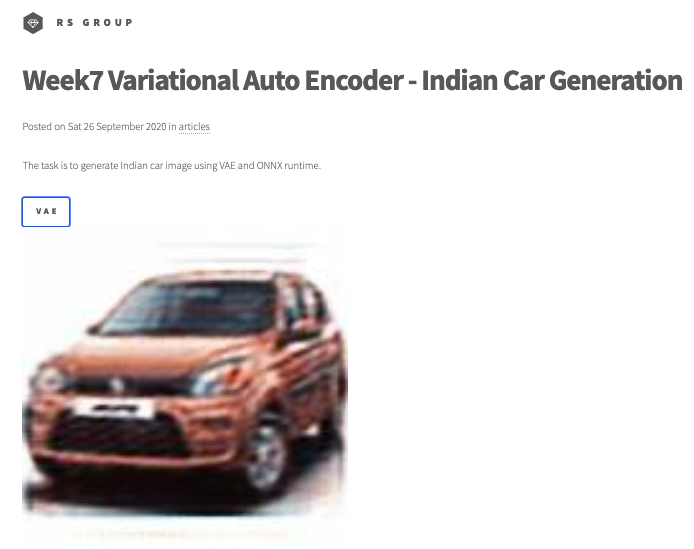
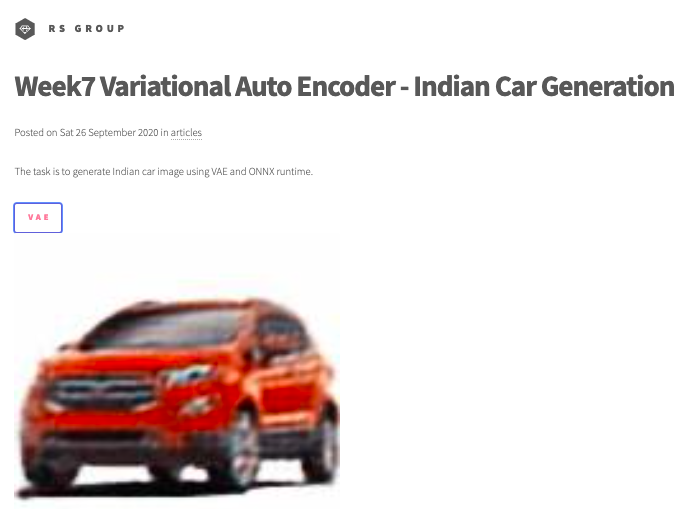
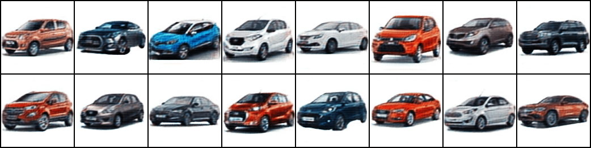

# Session 7 - Variational AutoEncoder

## 1. Executive Summary
**Group Members:** *Ramjee Ganti, Srinivasan G, Roshan, Dr. Rajesh and Sujit Ojha*

### **Objectives**:

- Implement Variational Auto-Encoder. Read the [paper](https://arxiv.org/pdf/1906.02691.pdf) 
- Upload the model to AWS lambda
- Make sure that reconstruction is happening properly.

### **Results**:

- Team hosted static website : http://rsgroup.s3-website.ap-south-1.amazonaws.com/
- Website results
    - 
- Colab results
    **Sample input**
    - 
    **Reconstructed image**
    - 

### **Variational AutoEncoder**

- The model proposed pass the input through a encode, decoder newtwork and a bottle neck layer to regenerate the original image back.   
- The model is tuned in such  a way that the bottle neck element is minimum still able to do reconstruction.
- Adam optimizer is used as opimizer with a learning rate of 1e-3.
- Training is done for 3000 epochs

## 2. Steps (Developer Section)

## 3. References

1. [EVA4 Phase2 Session7, Variational Auto Encoder](https://theschoolof.ai/)

