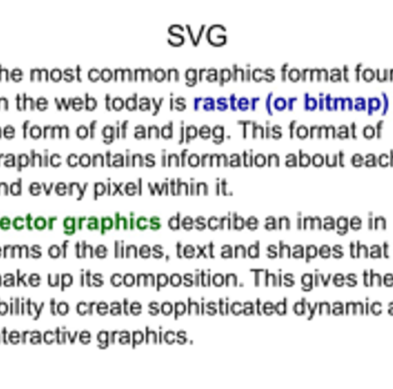

# Session 7 - Super Resolution GAN

## 1. Executive Summary
**Group Members:** *Ramjee Ganti, Srinivasan G, Roshan, Dr. Rajesh and Sujit Ojha*

### **Objectives**:

- Implement Variational Super resolution GAN. Read the [paper](https://arxiv.org/pdf/1609.04802.pdf) 
- Upload the model to AWS lambda
- Make sure that the model generate super resolution image.

### **Results**:

- Team hosted static website : http://rsgroup.s3-website.ap-south-1.amazonaws.com/
- Website results
    - 
- Colab results
 **Sample image and output**

    **Low Resolution image**
    - 
    
    **High Resolution image**
    - 
    
     **Fake High Resolution image**
    - 
    
 **On Text image**
 
    **Low Resolution image**
    - 
    
    **High Resolution image**
    - 
    
     **Fake High Resolution image**
    - 

### **Image Super Resolution**

- Super-resolution GAN applies a deep network in combination with an adversary network to produce higher resolution images.   
- During the training, A high-resolution image (HR) is downsampled to a low-resolution image (LR). 
  A GAN generator upsamples LR images to super-resolution images (SR). 
  We use a discriminator to distinguish the HR images and backpropagate the GAN loss to train the discriminator and the generator.
- The propposed model is capable of generating image of 4X sinze.
- Adam optimizer is used in both generator and descrimantor network.
- Training is done for 200 epochs.

## 2. Steps (Developer Section)

## 3. References

1. [EVA4 Phase2 Session7, Variational Auto Encoder](https://theschoolof.ai/)
2. [SRGAN implementation] (https://github.com/leftthomas/SRGAN)
3. [SRGAN Paper] (https://arxiv.org/pdf/1609.04802.pdf)

