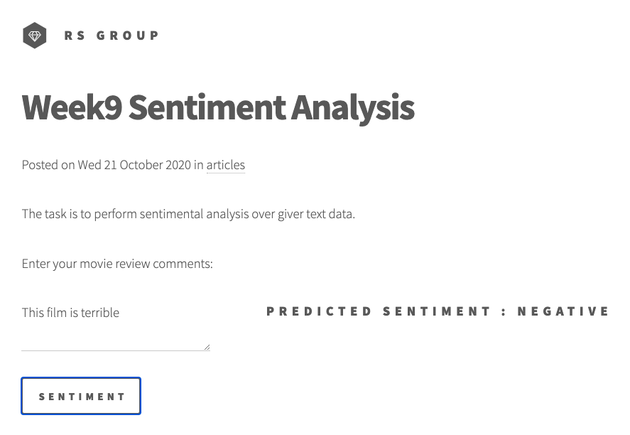
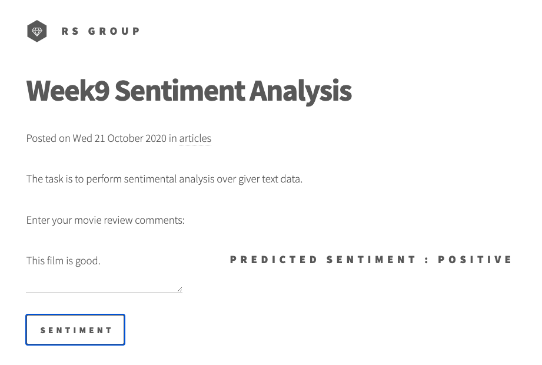
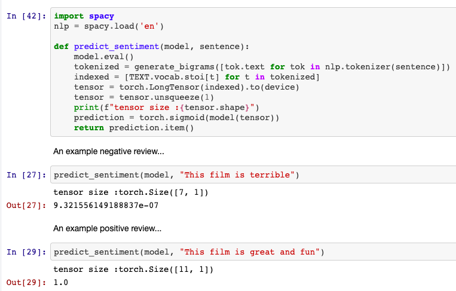

# Session 9 - Neural Embedding

## 1. Executive Summary
**Group Members:** *Ramjee Ganti, Srinivasan G, Roshan, Dr. Rajesh and Sujit Ojha*

### **Objectives**:

- Practise the above 6 colab files. 
- Move anyone to Lambda. 

### **Results**:

- Team hosted static website : http://rsgroup.s3-website.ap-south-1.amazonaws.com/
- Website results
    - 
- Colab results
    - 

### **Key Highlights**
- Training
- Deployment in AWS Lambda using serverless.

## 2. Steps (Developer Section)

* 1 - [Simple Sentiment Analysis](https://github.com/bentrevett/pytorch-sentiment-analysis/blob/master/1%20-%20Simple%20Sentiment%20Analysis.ipynb) 

    This tutorial covers the workflow of a PyTorch with TorchText project. We'll learn how to: load data, create train/test/validation splits, build a vocabulary, create data iterators, define a model and implement the train/evaluate/test loop. The model will be simple and achieve poor performance, but this will be improved in the subsequent tutorials.

* 2 - [Upgraded Sentiment Analysis](https://github.com/bentrevett/pytorch-sentiment-analysis/blob/master/2%20-%20Upgraded%20Sentiment%20Analysis.ipynb) 

    Now we have the basic workflow covered, this tutorial will focus on improving our results. We'll cover: using packed padded sequences, loading and using pre-trained word embeddings, different optimizers, different RNN architectures, bi-directional RNNs, multi-layer (aka deep) RNNs and regularization.

* 3 - [Faster Sentiment Analysis](https://github.com/bentrevett/pytorch-sentiment-analysis/blob/master/3%20-%20Faster%20Sentiment%20Analysis.ipynb) 

    After we've covered all the fancy upgrades to RNNs, we'll look at a different approach that does not use RNNs. More specifically, we'll implement the model from [Bag of Tricks for Efficient Text Classification](https://arxiv.org/abs/1607.01759). This simple model achieves comparable performance as the *Upgraded Sentiment Analysis*, but trains much faster.

* 4 - [Convolutional Sentiment Analysis](https://github.com/bentrevett/pytorch-sentiment-analysis/blob/master/4%20-%20Convolutional%20Sentiment%20Analysis.ipynb) 

    Next, we'll cover convolutional neural networks (CNNs) for sentiment analysis. This model will be an implementation of [Convolutional Neural Networks for Sentence Classification](https://arxiv.org/abs/1408.5882).

* 5 - [Multi-class Sentiment Analysis](https://github.com/bentrevett/pytorch-sentiment-analysis/blob/master/5%20-%20Multi-class%20Sentiment%20Analysis.ipynb) 
    
    Then we'll cover the case where we have more than 2 classes, as is common in NLP. We'll be using the CNN model from the previous notebook and a new dataset which has 6 classes.

* 6 - [Transformers for Sentiment Analysis](https://github.com/bentrevett/pytorch-sentiment-analysis/blob/master/6%20-%20Transformers%20for%20Sentiment%20Analysis.ipynb) 

* 7 - Deployment [handler.py](GAN-Deployment/handler.py) and [serverless.yml](GAN-Deployment/serverless.yml)
    - Using serverless, python-plugin-requirements

## 3. References

1. [PyTorch Sentiment Analysis](https://github.com/bentrevett/pytorch-sentiment-analysis)
2. [Save and Load Machine Learning Models in Python with scikit-learn](https://machinelearningmastery.com/save-load-machine-learning-models-python-scikit-learn/)
3. [How to Speed up AWS Lambda deployment on Serverless Framework by leveraging Lambda Layers.](https://gaurav4664.medium.com/how-to-speed-up-aws-lambda-deployment-on-serverless-framework-by-leveraging-lambda-layers-623f7c742af4)
4. [EVA4 Phase2 Session9, Neural Embedding](https://theschoolof.ai/)

